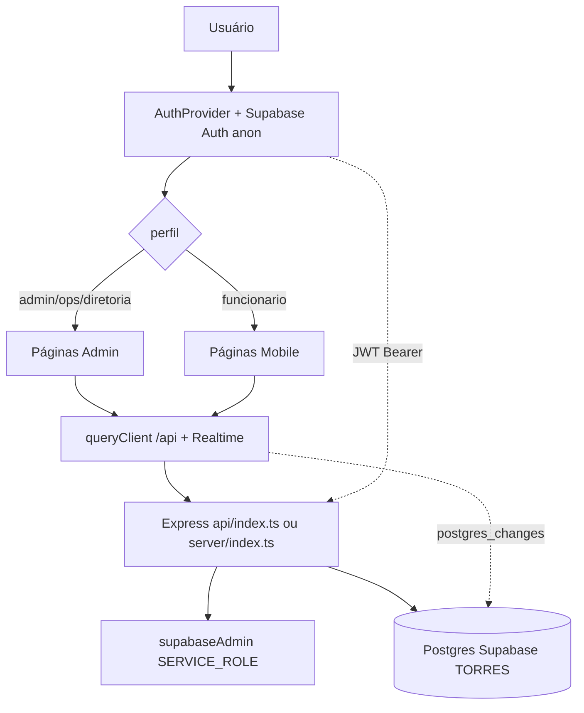
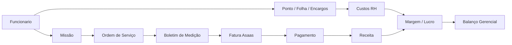

# Knowledge Graph — Sistema Torres

> **AVISO:** mapa auxiliar. SSOT e normas obrigatórias: [`docs/governanca/`](./governanca/README.md).
> Trechos que mencionam gestor-medicao/gestor-dados como rotas ativas podem estar **desatualizados** (módulos órfãos — ver `docs/governanca/09`).

## Arquitetura em camadas

> **Nota:** não existe pasta `client/src/services`. O padrão oficial do projeto é UI → `lib/queryClient` → `/api/*` → `server/routes/*` → Supabase/Drizzle. Tratar `server/routes` + `client/lib` como a camada de serviços.

## Fluxo empresarial

## Fluxo operacional / financeiro

```mermaid
flowchart LR
  Cliente --> Contrato[Tabela / contrato]
  Contrato --> OS[OS]
  OS --> Franquia[Franquia KM/hora]
  Franquia --> Exc[Excedentes]
  Exc --> Ped[Pedágios / despesas]
  Ped --> Oficial[Valor oficial servidor]
  Oficial --> Aprov[Aprovação]
  Aprov --> Fat[Faturamento]
  Fat --> Conc[Conciliação]
  Conc --> Pag[Pagamento]
```

## Mapa rota → dados (núcleo)

| Rota | Página | API / service | Tabelas principais | Env |
|------|--------|---------------|--------------------|-----|
| `/admin` | login | Supabase Auth + `/api/auth/me` | `users`, `employees` | VITE_SUPABASE_* |
| `/admin/dashboard` | dashboard | `/api/*` pendências | várias | — |
| `/admin/service-orders` | OS | `/api/service-orders` | `service_orders` | — |
| `/admin/boletim-medicao` | boletim | `/api/boletim-medicao` | `escort_billings` | — |
| `/admin/gestor-medicao` | auditoria medição | `/api/gestor-medicao` | `escort_billings` | — |
| `/admin/gestor-dados` | gestor dados | `/api/gestor-dados` | várias | — |
| `/admin/faturas` | faturas | `/api/invoices` Asaas | `invoices` | ASAAS_* |
| `/admin/financeiro` | financeiro | `/api/financeiro*` | `financial_transactions` | — |
| `/admin/balanco-gerencial` | balanço | `/api/balanco*` SWR | snapshot | — |
| `/admin/whatsapp` | WhatsApp | `/api/whatsapp` | `whatsapp_*` | ZAPI_* |
| `/admin/control-id` | ponto RH | `/api/control-id` | `control_id_*` | CONTROLID_ENC_KEY, RHID_* |
| `/admin/consultas` | consultas | `/api/consultas` | logs | APIBRASIL_* |
| `/admin/inter-extrato` | Inter | `/api/inter` | `inter_*` | INTER_* |
| `/mobile/*` | app vigilante | `/api/mobile/*` | OS, ponto, fotos | VITE_SUPABASE_* |

## Desconexões conhecidas / corrigidas

| Item | Status |
|------|--------|
| `/admin/consultas` sem rota | **Corrigido** — rota religada em `App.tsx` |
| `escort-billing.tsx` órfão | Preservar arquivo; UI migrada para faturas/clients |
| Migration `timeclock_shifts_faces` | **Não existe** neste repo |
| Tabela `rh_employees` | **Não existe** — usar `employees` |
| Camada Vercel sem deps | **Corrigido** — `serverless-http`, `@vercel/node` |
| Plugins `@replit/vite-*` | **Removidos** |
| URL hardcoded Replit em leads | **Substituída** por `PUBLIC_SITE_URL` / Vercel |
| Realtime invalidando `/api/employees` | Monitorar (não é bug de migration) |
| Fórmulas financeiras no frontend | Evitar — fonte oficial em `server/lib/boletim-totals`, `billing-calc` |

## Integrações externas

| Integração | Entrada | Status migração |
|------------|---------|-----------------|
| Supabase | Auth + DB + Realtime | Confirmado projeto TORRES |
| Asaas | API + webhook | Vars no `.env` |
| Z-API | WhatsApp | Vars no `.env` |
| Banco Inter | API + certs | **Vars ausentes** |
| SSX / TrucksControl | telemetria/câmeras | Vars no `.env` |
| TicketLog API | desativada (410) | Obsoleta |
| eNotas / PlugNotas / MP / Stripe | — | Não usados |
